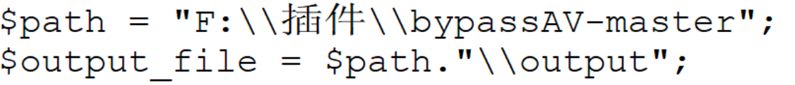
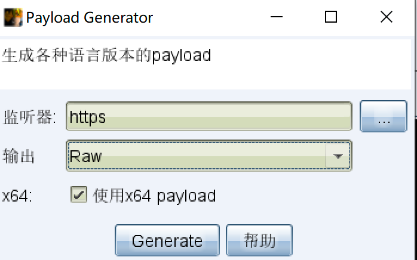
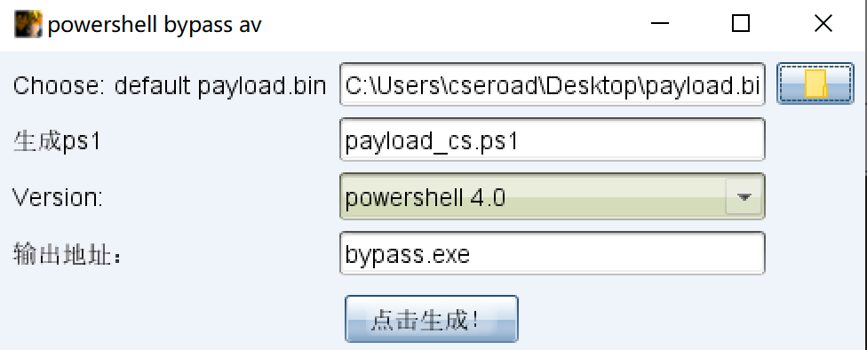
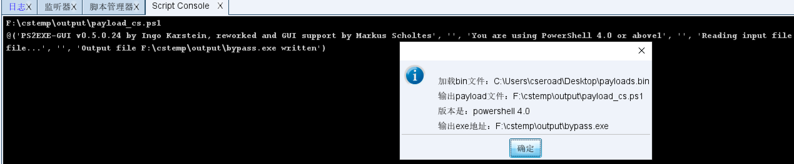
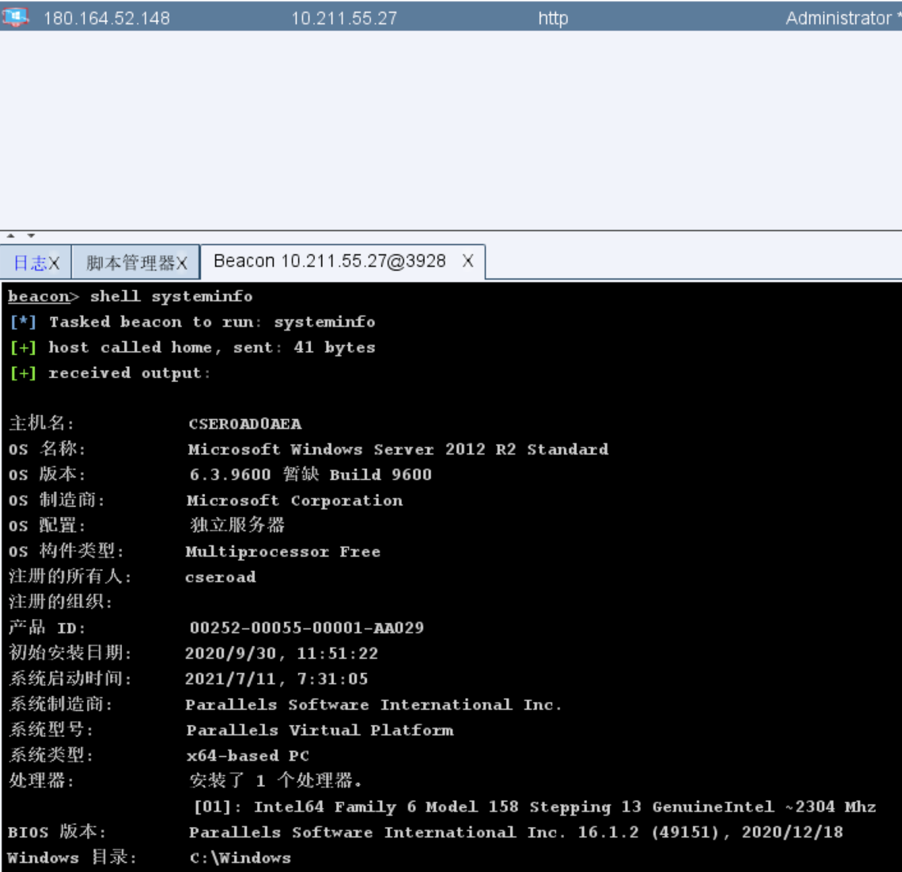
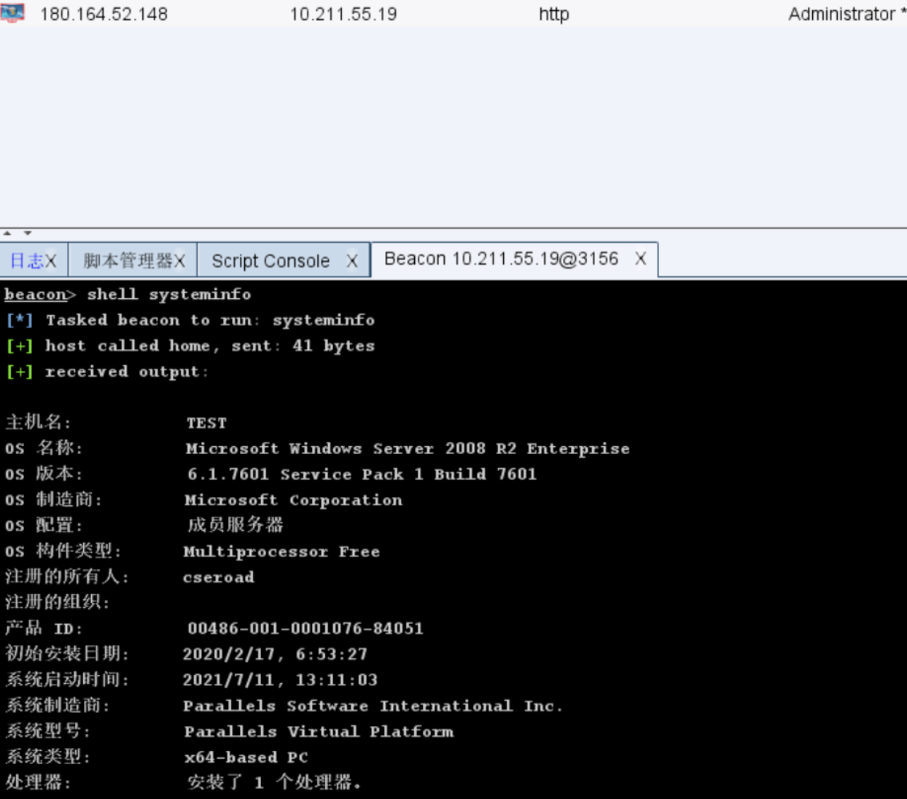
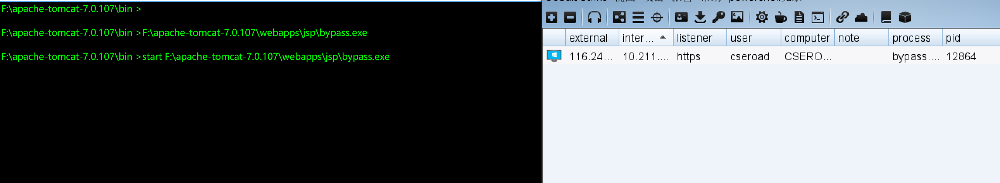
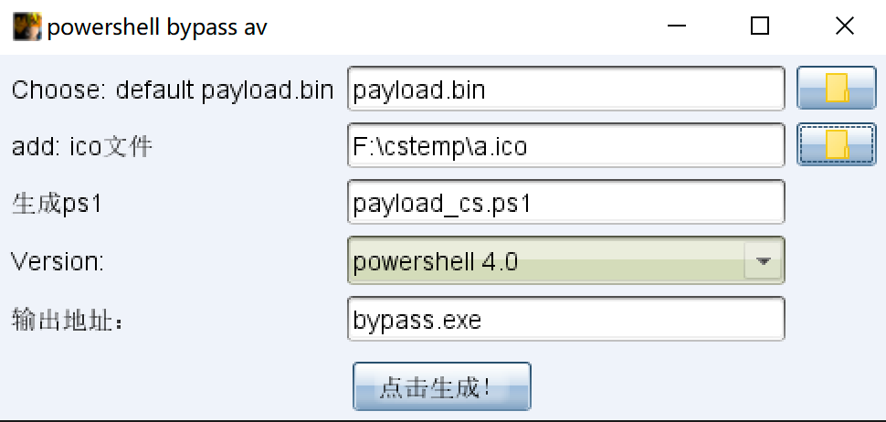

## BypassAV

**仅用于技术交流，请勿用于非法用途。**

该插件没有什么技术含量，本质上利用的ps2exe.ps1脚本编译为exe，只是不想在命令行里操作，将其写为cna脚本，方便直接快速生成免杀的可执行文件。且只有50KB，目前支持exe、ps1文件格式。

*注：建议在powershell 4.0版本以上机器安装，可向下兼容powershell 2.0。*

## 使用 

在导入cna脚本之前，只需要修改当前路径$path为powershell_bypass.cna所在的真实路径即可。

选择Cobalt Strike生成BIN文件。

启用该cna脚本，选择指定的bin文件，点击生成恶意的ps1文件、exe可执行文件，

点击即可上线。

使用powershell 4.0上线server 2012

使用powershell 2.0上线server 2008

如果在webshell触发该可执行文件，需要start命令

## 更新日志2021/7/18

必须同时存在bin文件和ico图标
## 参考文章

https://www.jianshu.com/p/fb078a99e0d8

https://www.jianshu.com/p/f158a9d6bdcf
