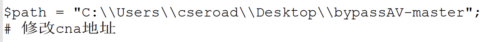
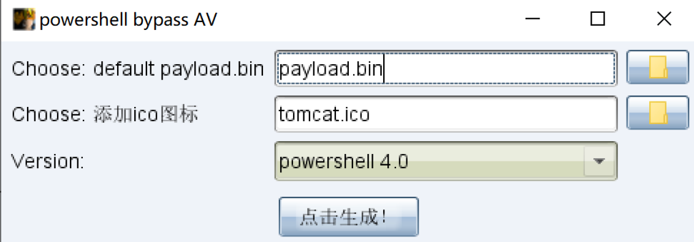

## BypassAV

**仅用于技术交流，请勿用于非法用途。**

该插件没有什么技术含量，本质上利用的ps2exe.ps1脚本编译为exe，只是不想在命令行里操作，将其写为cna脚本，方便直接快速生成免杀的可执行文件。且只有50KB，目前仅支持exe文件格式。

*注：建议在powershell 4.0版本以上机器运行，可向下兼容powershell 2.0。*

## 更新日志2022/3/30

- 自定义输出地址
- 提供ico图标bypass
- 生成的```c:\windows\temp\payload_tmp.ps1```作为临时文件，使用后并删除

修改了部分代码，再重新写份使用说明。

在导入cna脚本之前，只需要修改当前路径$path所在的真实路径即可。




首先选择Cobalt Strike生成后门文件，为bin格式。


选择刚才生成的bin文件，以及powershell的版本，点击即可生成exe可执行文件，



使用powershell 4.0上线server 2012


使用powershell 2.0上线server 2008


如果在webshell触发该可执行文件，需要start命令


## 参考文章

https://www.jianshu.com/p/fb078a99e0d8

https://www.jianshu.com/p/f158a9d6bdcf
